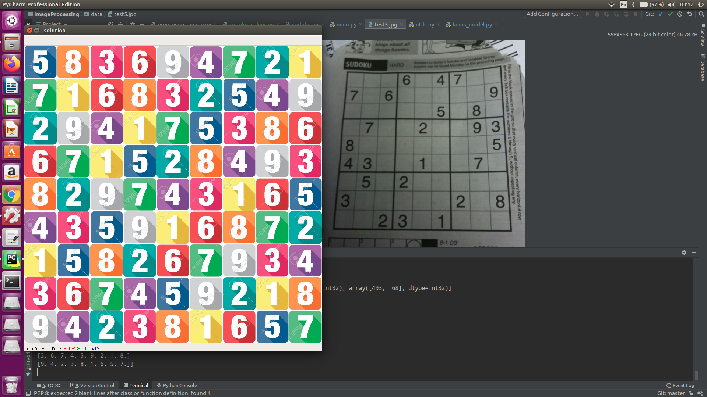

## Image Processing Project

This is the implementation of our team for project **Sudoku Solver On Image** using OpenCV and Deep Learning in course Image Processing.

### 1. Installation:

- clone this project to your working directory

- then please type the followed command to install project's package dependencies:

    ``pip install -r requirements.txt``

### 2.Running:

- after install project's package dependencies, to run the project on your test image.
please type command

    ``python main.py --image $YOUR_IMAGE_PATH$``

    by default the test image path is "data/test.jpeg".

### 3.Result:

Some result for our project

